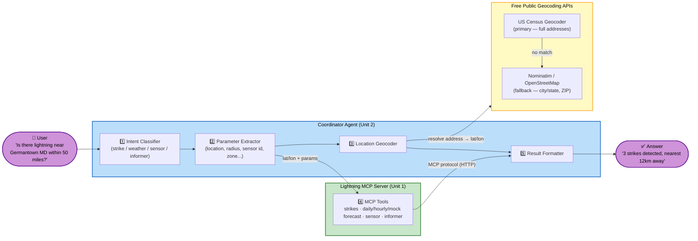
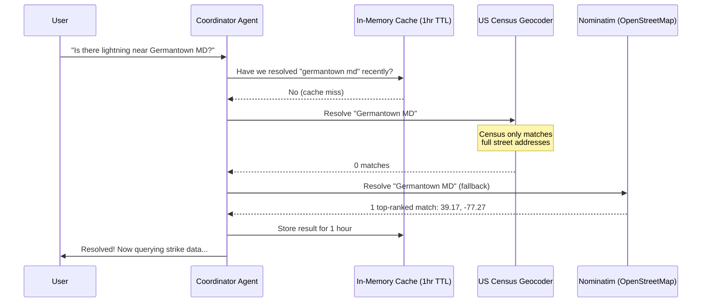

# ⚡ Lightning Detection MCP — Server & Coordinator Agent

A proof-of-concept **multi-agent system** for lightning detection and weather warning, built on the [Model Context Protocol (MCP)](https://modelcontextprotocol.io/). Ask a plain-English question like *"Is there lightning near Germantown MD within 50 miles?"* and get a structured answer — no API wrangling required.

> 📍 This is Phase 1 of a 3-phase roadmap. See [Roadmap](#-roadmap) for what's real today vs. planned.

---

## 🎯 What is this?

Most "lightning detection" demos either hardcode a handful of cities or require you to already know latitude/longitude. This project exists to show a **realistic, extensible pattern** for a natural-language weather-safety assistant:

- A user (or another AI agent) asks a question in plain English.
- A lightweight **Coordinator Agent** figures out *what* is being asked and *what information* it needs.
- If the question mentions a place — a city, a ZIP code, or a full street address — the Coordinator resolves it to real coordinates using **free, public geocoding APIs** (no API key, no cost).
- The Coordinator then calls a dedicated **Lightning MCP Server** over the real MCP protocol (not a shortcut function call) to get the answer.
- The result comes back as a clear, human-readable summary.

This mirrors a common enterprise pattern: a **Coordinator/Orchestrator Agent** sitting in front of one or more **domain-specific MCP servers**, each responsible for a narrow slice of functionality (lightning here; could be accounts, transactions, inventory, etc. in other systems).

---

## 🧩 How it fits together



**Text version** (if the diagram doesn't render in your viewer): User asks a question → Coordinator Agent classifies intent → extracts parameters → resolves any place name to coordinates (Census Geocoder first, Nominatim as fallback) → calls the matching tool on the Lightning MCP Server over the real MCP protocol → formats the result into a plain-English answer.

### Why two separate services?

| | Coordinator Agent (Unit 2) | Lightning MCP Server (Unit 1) |
|---|---|---|
| **Job** | Understand the user, gather the right inputs | Know everything about lightning/weather domain data |
| **Talks to** | The user (HTTP) and the MCP Server (MCP protocol) | Only the Coordinator, via MCP |
| **Knows about geocoding?** | Yes | No — it only ever sees lat/lon |
| **Analogy** | A helpful front-desk assistant | A specialist who only speaks in coordinates |

This separation means the Lightning MCP Server could be reused by a completely different front-end (a Slack bot, a different agent, a dashboard) without duplicating any domain logic — and the Coordinator's natural-language and geocoding skills could front *other* domain MCP servers (accounts, transactions, inventory...) in the future.

---

## ✨ What can it actually do today? (Phase 1)

| Ask about... | Example query | What happens |
|---|---|---|
| ⚡ **Lightning strikes** | *"Get all the LX for Germantown MD around 50 miles"* | Resolves "Germantown MD" → lat/lon, returns strike count, CG/IC breakdown, nearest-strike distance. Also supports explicit date ranges (*"...between 2026-01-01 and 2026-01-05"*), relative windows (*"...in the last 3 hours"*, *"...yesterday"*), and a CG/IC filter (*"cloud-to-ground strikes near..."*) |
| 🌦️ **Daily weather forecast** (real data) | *"What's the weather in Austin, TX?"* | Resolves location, calls the **real** external forecast API, returns per-day conditions (temp, humidity, precip chance, wind, etc.) |
| ⏱️ **Hourly weather forecast** (real data) | *"Give me the hourly forecast for Urbana, MD"* | Resolves location, calls the **real** external forecast API, returns per-hour conditions (temp, dew point, wind gust, heat index, etc.) |
| 🌦️ **15-day weather forecast** (stub data) | *"What's the 15-day forecast for Austin, TX?"* | Legacy stub path — returns a 15-entry synthetic forecast with a lightning-risk indicator. Kept for backward compatibility; see [Roadmap](#-roadmap) |
| 📡 **Sensor diagnostics** | *"Show diagnostics for sensor-001"* | Returns detection efficiency, GPS lock, uptime, calibration date, overall health |
| 🚨 **Warning device status** | *"Is the horn in zone-a powered on?"* | Returns device status, last activation, battery/power state |

**Location input is flexible** — all of these resolve correctly:
- City + State → `"Germantown MD"`, `"Austin, TX"`
- ZIP code → `"20874"`
- Full street address → `"1600 Pennsylvania Ave NW, Washington, DC 20500"`
- Raw coordinates → `"latitude 30.27, longitude -97.74"`

If a place name is ambiguous (e.g. just *"Springfield"* with no state) or can't be found at all, you get a clear error message instead of a silent wrong answer.

> ⚠️ **Sensor and warning-device data is still stubbed** (synthetic but realistic), as is the **15-day forecast** path. **Lightning strikes and daily/hourly weather forecasts now call real external APIs.** Location resolution and request routing are real throughout. See [Roadmap](#-roadmap).

---

## 🚀 Quick Start

### Prerequisites
- [Docker Desktop](https://www.docker.com/products/docker-desktop/) (or Docker Engine + Compose plugin on Linux)

### 1. Configure environment

```bash
cp .env.example .env
```

The defaults work out of the box for Phase 1 — no API keys required for geocoding (both providers are free and keyless). If you want real lightning-pulse data instead of stubs, add your own key for `LIGHTNING_PULSE_API_KEY` in `.env`.

### 2. Start everything

```bash
docker compose up -d --build
```

### 3. Check it's healthy

```bash
curl http://localhost:8020/health   # Lightning MCP Server
curl http://localhost:8001/health   # Coordinator Agent
```

### 4. Ask it something

```bash
curl -X POST http://localhost:8001/query \
  -H "Content-Type: application/json" \
  -d '{"query": "Is there lightning near Germantown MD within 50 miles?"}'
```

```json
{
  "toolName": "get_lightning_strikes_near_location",
  "result": { "strikeCount": 0, "cloudToGroundCount": 0, "intraCloudCount": 0, "maxIntensity": 0, "nearestStrikeDistance": 0 },
  "summary": "No lightning strikes detected in the search area."
}
```

### 5. Watch it work

```bash
docker compose logs -f coordinator-agent
```

You'll see structured JSON logs showing the full decision trail: intent classified → cache checked → Census Geocoder called → (if needed) Nominatim fallback called → MCP tool invoked → result returned.

### 6. Shut down

```bash
docker compose down
```

For full deployment instructions (including EC2), see [`DEPLOYMENT.md`](./DEPLOYMENT.md).

---

## 📂 Project Structure

```
mcp/
├── unit-1/                      # Lightning MCP Server — the domain specialist
│   ├── src/LightningMcpServer/  # 6 MCP tools (strike/daily/hourly real; mock weather/sensor/informer stub)
│   └── src/LightningCommon/     # Shared request/response models
│
├── unit-2/                      # Coordinator Agent — the natural-language front door
│   └── src/CoordinatorAgent/
│       ├── Services/
│       │   ├── IntentClassifier.cs      # "what are they asking for?"
│       │   ├── ParameterExtractor.cs    # "what inputs does the tool need?"
│       │   ├── LocationGeocoder.cs      # "turn that place name into lat/lon"
│       │   └── McpClient.cs             # "call the MCP Server"
│       └── Controllers/QueryController.cs
│
├── unit-3/                      # Infrastructure orchestration (Docker Compose, EC2 guide)
│
├── docker-compose.yml           # Runs unchanged locally or on EC2
├── DEPLOYMENT.md                # Step-by-step deploy + troubleshooting guide
└── aidlc-docs/                  # Full requirements/design/decision history (AI-DLC process)
```

Each unit also has its own `README.md` with build/run/API details: [`unit-1/README.md`](./unit-1/README.md), [`unit-2/README.md`](./unit-2/README.md).

---

## 🔍 Behind the scenes: how location resolution works

The most interesting part of this project is how it turns *"Germantown MD"* into real coordinates for free, with no API key:



**Design decisions worth knowing about:**
- **Two providers, one each for a reason.** The [US Census Geocoder](https://geocoding.geo.census.gov/geocoder/) is excellent at full street addresses but can't resolve a bare city/state or ZIP. [Nominatim](https://nominatim.org/) (OpenStreetMap) fills that gap. Both are free with no API key.
- **Only the top match is trusted from the fallback.** Nominatim often returns several same-state results for a simple query (e.g. 5 different "Germantown, Maryland" neighborhoods) — rather than asking the user to pick one every time, the single best-ranked match is used.
- **Automatic retries.** A network hiccup gets up to 2 extra attempts before giving up.
- **Caching.** Repeated lookups for the same place within an hour skip the external call entirely.
- **US-only, for now.** Both providers restrict to the United States in Phase 1.

---

## 🔌 How MCP tool wiring works

The Lightning MCP Server exposes **6 MCP tools**. The Coordinator Agent doesn't hardcode one tool per intent — for the `Weather` intent specifically, it picks the tool dynamically based on the forecast type detected in the query:

| MCP Tool | Data source | Called when... |
|---|---|---|
| `get_lightning_strikes_near_location` | Real (Lightning Pulse API) | Intent = Strike |
| `get_daily_weather_forecast` | **Real** (external Daily Forecast API, by ZIP or lat/lon) | Intent = Weather, **default** (no forecast-type keyword, or "daily") |
| `get_hourly_weather_forecast` | **Real** (external Hourly Forecast API, by lat/lon or free-text search) | Intent = Weather, query contains **"hourly"** |
| `get_weather_forecast` | Stub (synthetic, kept for backward compatibility) | Intent = Weather, query contains **"15-day"** |
| `get_sensor_diagnostics` | Stub | Intent = Sensor |
| `get_informer_status` | Stub | Intent = Informer |

This routing happens in `QueryController.ResolveWeatherToolName()` (unit-2) — it reads the `forecastType` parameter already extracted by `ParameterExtractor`, no separate classification pass needed. For the real Daily/Hourly tools, the Coordinator always resolves the query's location to lat/lon via the **same geocoder** used for strikes (`ILocationGeocoder`) before calling the tool — there's no separate geocoding path for weather. The Daily/Hourly tools also natively accept a ZIP code or free-text search string directly (bypassing the Coordinator's geocoder) for callers that already have that data.

**Example requests and what they route to:**

```bash
# Daily (real data) — the default for a plain weather question
curl -X POST http://localhost:8001/query -H "Content-Type: application/json" \
  -d '{"query": "What is the weather in Austin, TX?"}'
# → get_daily_weather_forecast, lat/lon resolved via geocoder

# Hourly (real data) — triggered by the word "hourly"
curl -X POST http://localhost:8001/query -H "Content-Type: application/json" \
  -d '{"query": "Give me the hourly forecast for Urbana, MD"}'
# → get_hourly_weather_forecast

# 15-day (legacy stub) — triggered by "15-day"
curl -X POST http://localhost:8001/query -H "Content-Type: application/json" \
  -d '{"query": "Give me the 15-day forecast for Austin, TX"}'
# → get_weather_forecast (stub)

# Strike with an explicit date range and CG/IC filter
curl -X POST http://localhost:8001/query -H "Content-Type: application/json" \
  -d '{"query": "Cloud-to-ground strikes near Austin, TX from 2026-01-01 to 2026-01-05"}'
# → get_lightning_strikes_near_location, pulseType=CG, startDateTime/endDateTime set
```

The real Daily/Hourly tools trim the external API's raw response down to the fields that matter (abbreviated but readable: `tempC`, `precipPct`, `windSpeedMs`, `cloudPct`, etc.) rather than returning every field the upstream API provides — see `unit-1/src/LightningCommon/DomainModels.cs` (`DailyForecastPeriod`, `HourlyForecastPeriod`) for the exact field list.

---

## 🛠️ Configuration

All configuration is via environment variables (see `.env.example` for the full, commented list). Nothing below is required to get started — every value has a working default.

| Variable | Default | Purpose |
|---|---|---|
| `LOG_LEVEL` | `INFO` | Shared log verbosity for both services |
| `LISTEN_PORT_MCP` / `LISTEN_PORT_COORDINATOR` | `8000` / `8001` | Internal container ports |
| `MCP_SERVER_URL` | `http://lightning-mcp-server:8000` | How the Coordinator finds the MCP Server (Compose DNS) |
| `LIGHTNING_PULSE_API_BASE_URL` / `LIGHTNING_PULSE_API_KEY` | QA endpoint / *(none)* | Real lightning-pulse data source for Unit 1 |
| `WEATHER_FORECAST_API_BASE_URL` | *(none — required)* | Real weather forecast API base URL for `get_daily_weather_forecast` / `get_hourly_weather_forecast`. No API key needed. |
| `WEATHER_FORECAST_DAILY_BY_ZIPCODE_PATH` / `..._DAILY_BY_LATLON_PATH` / `..._HOURLY_BY_LATLON_PATH` / `..._HOURLY_BY_SEARCH_PATH` | Matches the staging API's current routes | Endpoint paths for each forecast call shape — override only if the API's routes change |
| `CENSUS_GEOCODER_BASE_URL` / `..._TIMEOUT_SECONDS` | Census's public URL / `10` | Primary geocoder (full addresses) |
| `NOMINATIM_BASE_URL` / `..._TIMEOUT_SECONDS` / `..._USER_AGENT` | OSM's public URL / `10` / project name | Fallback geocoder (city/state, ZIP) |

> Note: the host-side port in `docker-compose.yml` for the MCP Server is currently mapped to `8020` (to avoid a local port-8000 conflict) — adjust this and `LISTEN_PORT_MCP` together if you need a different port.

---

## 🧪 Testing

```bash
# Unit 1 — Lightning MCP Server (50 tests)
dotnet test unit-1/tests/LightningMcpServer.Tests/LightningMcpServer.Tests.csproj

# Unit 2 — Coordinator Agent (62 tests)
dotnet test unit-2/tests/CoordinatorAgent.Tests/CoordinatorAgent.Tests.csproj
```

All external calls (MCP protocol, Census Geocoder, Nominatim) are mocked in the test suite — no network access or API keys needed to run tests. The behavior has also been verified live against the real Docker Compose stack and the real public geocoding APIs (see `aidlc-docs/construction/build-and-test/build-and-test-summary.md`).

---

## 🗺️ Roadmap

| Phase | Status | Scope |
|---|---|---|
| **Phase 1** (this repo) | ✅ Complete | MCP Server + Coordinator Agent with real intent routing and **real, free location geocoding**; lightning strikes and daily/hourly weather forecasts now call **real external APIs**; sensor/device status and the legacy 15-day forecast remain realistic stub data; Docker Compose deployment |
| **Phase 2** | 📋 Planned | Replace remaining stub data with real integrations: stateful sensor/device feeds; add conversation/session memory; basic authentication |
| **Phase 3** | 📋 Planned | Complete the reference architecture: edge layer (WAF/rate-limiting), PII redaction, observability/tracing, cost tracking, agent evaluation suite; potentially add more domain agents beyond lightning |

See `aidlc-docs/inception/requirements/requirements.md` for full detail on what's in/out of scope for each phase.

---

## 📚 Further Reading

This project was built using an AI-driven development lifecycle (AI-DLC) that keeps a full paper trail of every requirement, design decision, and correction. If you want to understand *why* something was built a certain way:

- `aidlc-docs/inception/requirements/requirements.md` — full functional & non-functional requirements
- `aidlc-docs/construction/unit-2/functional-design/business-rules.md` — the exact rules governing location resolution, ambiguity, and caching
- `aidlc-docs/audit.md` — a timestamped log of every decision made during development, including real bugs found via live testing and how they were fixed
- `DEPLOYMENT.md` — deployment, verification, and troubleshooting
