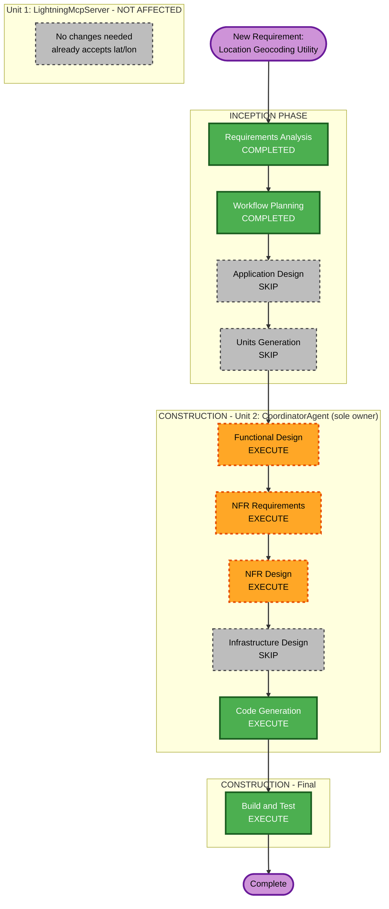

# Execution Plan — Addendum: Location Geocoding Utility (FR-4)

> **Corrected 2026-10-06**: An earlier version of this plan assumed the utility would live in `LightningCommon` (Unit 1's shared library), per the original Q2 answer. Investigation during Functional Design kickoff found that assumption architecturally infeasible: `CoordinatorAgent` (Unit 2) has no project reference to `LightningCommon` and runs as a fully separate container from `LightningMcpServer` (Unit 1), communicating only over the MCP protocol. The actual free-text location parsing (`TryExtractLocation`, a hardcoded 10-city dictionary) lives in Unit 2's `ParameterExtractor.cs`; Unit 1's `StrikeDetectionModule` / `get_lightning_strikes_near_location` MCP tool already accepts raw `latitude`/`longitude`, not location text. The user confirmed (via clarifying question): place the utility in **Unit 2 only**. This version reflects that correction — Unit 1 requires **no changes**.

## Detailed Analysis Summary

### Transformation Scope (Brownfield)
- **Transformation Type**: Single-component-boundary change — additive utility entirely within Unit 2; no new units/services.
- **Primary Changes**:
  - New `LocationGeocoder` utility class inside **Unit 2 (`CoordinatorAgent`)**: resolves free-text location (City+State, ZIP, or full street address) → lat/lon via the US Census Geocoder, with ambiguous/not-found handling, in-memory TTL cache, retry/backoff.
  - `ParameterExtractor.cs` (Unit 2) updated: `TryExtractLocation` replaces the hardcoded `KnownLocations` 10-city dictionary with a call to `LocationGeocoder`; radius-unit detection (miles/km) already exists but gains a 100-mile cap check.
  - New structured error paths in Unit 2 for: ambiguous match (list candidates), not-found, and over-cap radius — surfaced back to the user via the existing query-response flow (`QueryController`/`ResultFormatter`).
- **Related Components**: `CoordinatorAgent` (Unit 2) only. **No changes to Unit 1** (`LightningMcpServer`/`LightningCommon`) — it already accepts `latitude`/`longitude` directly. **No changes to Unit 3** (Infrastructure Orchestration) — no new infra resources, same Docker image/compose topology (at most a new environment variable for geocoder timeout/cache TTL, handled directly in Code Generation).

### Change Impact Assessment
- **User-facing changes**: Yes — users can now say "Germantown MD", a ZIP, or a full street address (previously only the 10 hardcoded cities or raw lat/lon worked) and get resolved strike data; new error messages for ambiguous/not-found locations and over-cap radius.
- **Structural changes**: No — no new units, no new services, no new deployment topology, no new inter-unit contract changes (MCP tool schema for `get_lightning_strikes_near_location` is unchanged).
- **Data model changes**: Yes (minor, Unit 2 only) — new internal `GeocodeResult` (lat/lon + normalized matched address) and cache-entry model inside `CoordinatorAgent`.
- **API changes**: None at the MCP boundary. Unit 2's own HTTP query endpoint behavior changes (better location resolution, new error response shapes) but its external contract (accepts free-text query, returns formatted result/error) is unchanged.
- **NFR impact**: Yes — introduces a new external dependency (US Census Geocoder) from Unit 2, with associated timeout/retry/caching behavior (FR-4) not previously present.

### Component Relationships
- **Primary Component**: `CoordinatorAgent` (Unit 2) — sole owner of FR-4.
- **Shared Components**: None — no cross-unit sharing needed (`LightningCommon` remains Unit 1-only, untouched).
- **Dependent Components**: None outside Unit 2 — Unit 1 is unaffected and requires no retest beyond existing regression coverage.
- **Supporting Components**: None new (no new monitoring/infra).

| Component | Change Type | Change Reason | Change Priority |
|---|---|---|---|
| `CoordinatorAgent` (Unit 2) | Minor (new utility + call-site + error paths) | Sole owner of FR-4 | Critical |
| `LightningMcpServer` / `LightningCommon` (Unit 1) | **None** | Already accepts lat/lon directly | N/A |
| Unit 3 (Infra Orchestration) | Configuration-only (possible new env var) | No new infra resources | Optional |

### Risk Assessment
- **Risk Level**: Low — isolated, additive change fully contained within Unit 2; no cross-unit contract changes; easy rollback (new utility class + one call-site change).
- **Rollback Complexity**: Easy — revert the utility and `ParameterExtractor.cs` change; no data migrations, no infra changes, no impact on Unit 1/Unit 3.
- **Testing Complexity**: Moderate — new external dependency (US Census Geocoder) needs to be tested with a fake/mocked `HttpClient` for ambiguous/not-found/timeout/retry paths within Unit 2's existing test project (`CoordinatorAgent.Tests`).

## Workflow Visualization

**Text alternative** (if diagram doesn't render): Requirements Analysis (done) → Workflow Planning (done) → Application Design (skip) → Units Generation (skip) → Unit 1 (not affected, no changes) → Unit 2: Functional Design → NFR Requirements → NFR Design → Infrastructure Design (skip) → Code Generation → Build and Test → Complete.

## Phases to Execute

### INCEPTION PHASE
- [x] Workspace Detection (COMPLETED — prior session)
- [N/A] Reverse Engineering (greenfield project; brownfield-style re-entry handled via this execution plan)
- [x] Requirements Analysis (COMPLETED — FR-4 addendum approved; Unit 2-only placement corrected 2026-10-06)
- [⏭️] User Stories (SKIPPED — no new user persona or acceptance-criteria ambiguity beyond what FR-4/Acceptance Criteria #7-9 already specify)
- [x] Workflow Planning (COMPLETE — this document, corrected)
- [ ] Application Design — **SKIP**
  - **Rationale**: No new component/service boundaries; the geocoding utility's methods and business rules are already fully specified in FR-4. Nothing further to design at the architecture level.
- [ ] Units Generation — **SKIP**
  - **Rationale**: No new units; this modifies existing Unit 2 (`CoordinatorAgent`) only.

### CONSTRUCTION PHASE — Unit 1: `LightningMcpServer` + `LightningCommon`
- **NOT RE-OPENED — no changes required.** Unit 1's `get_lightning_strikes_near_location` MCP tool already accepts `latitude`/`longitude` directly (see `McpTools.cs`); it has no dependency on free-text location parsing. All of Unit 1's prior-completed stages remain as-is.

### CONSTRUCTION PHASE — Unit 2: `CoordinatorAgent` (sole owner of FR-4)
- [ ] Functional Design — **EXECUTE** (minimal-to-standard depth)
  - **Rationale**: New data model (`GeocodeResult`, cache entry) and business rules (ambiguous-match error shape, not-found error shape, radius-unit detection + 100-mile cap enforcement) need definition before Code Generation.
- [ ] NFR Requirements — **EXECUTE** (minimal depth)
  - **Rationale**: New external dependency (US Census Geocoder) introduces timeout, retry/backoff, and caching NFRs not previously present in Unit 2.
- [ ] NFR Design — **EXECUTE** (minimal depth)
  - **Rationale**: Concrete retry count/backoff strategy, cache TTL value, and timeout value need to be fixed before Code Generation.
- [ ] Infrastructure Design — **SKIP**
  - **Rationale**: No new infrastructure resources or deployment topology changes; at most a new environment variable (e.g. geocoder timeout/cache TTL), handled directly in Code Generation.
- [ ] Code Generation — **EXECUTE (ALWAYS)**
  - **Rationale**: Implements the `LocationGeocoder` utility, updates `ParameterExtractor.cs`, adds unit tests (including mocked-HTTP ambiguous/not-found/timeout/retry paths).

### Build and Test (after Unit 2's Code Generation)
- [ ] Build and Test — **EXECUTE (ALWAYS)**
  - **Rationale**: Re-run Unit 2's unit + integration tests for the new/changed behavior (geocoding success paths for all 3 input formats, ambiguous match, not-found, over-cap radius, retry/timeout), and re-verify the Docker Compose stack end-to-end per the existing verified pattern (Unit 1 unaffected, included only as part of the full-stack re-verification).

### OPERATIONS PHASE
- [ ] Operations — PLACEHOLDER (unchanged — still a future-expansion placeholder per CLAUDE.md)

## Package/Unit Update Sequence
1. **Unit 2 (`CoordinatorAgent`)** only — no dependency ordering needed since Unit 1 is untouched.
2. **Build and Test** — full-stack re-verification (both containers) to confirm no regression in Unit 1 and correct new behavior in Unit 2.

## Estimated Timeline
- **Total Stages Executing**: 4 (Unit 2: Functional Design, NFR Requirements, NFR Design, Code Generation) + Build and Test
- **Estimated Duration**: Small addition — smaller than originally estimated, since only one unit is touched.

## Success Criteria
- **Primary Goal**: A user can supply City+State, ZIP, or full street address in a natural-language query and get correct lightning-strike data for the resolved location and requested radius (miles or km, capped at 100 miles), with clear errors for ambiguous/not-found locations and over-cap radius.
- **Key Deliverables**: `LocationGeocoder` utility + updated `ParameterExtractor.cs` (Unit 2 only), new/updated unit tests, updated integration tests, Docker Compose re-verification.
- **Quality Gates**: All new/updated unit tests pass; `docker compose up` stack re-verified end-to-end for at least one example per supported input format plus the 3 new error paths (ambiguous, not-found, over-cap radius).
- **Integration Testing**: Unit 2's existing Unit 1-facing MCP call path re-verified unchanged (regression check only, since Unit 1 is untouched).
